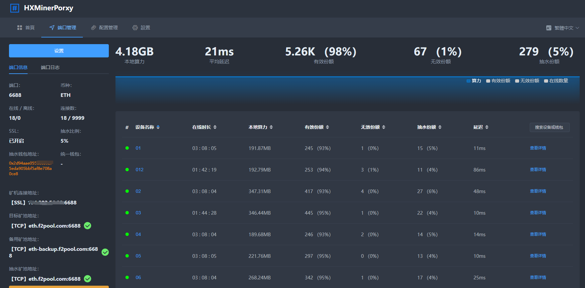

<div id="top"></div>

<!-- PROJECT LOGO -->
<div align="center">

# HxMinerProxy


  <!-- 
   -->

[![Contributors][contributors-shield]][contributors-url]
[![Forks][forks-shield]][forks-url]
[![Stargazers][stars-shield]][stars-url]
[![Issues][issues-shield]][issues-url]
<!--  -->


  <p align="center">
    <h2>:zap: 原创GO语言编写，功能强大，性能强劲。支持ETH/ETC/BTC/BCH抽水</h2>
    <h2>:zap: 抽水固定千分之2,纯转发不抽水</h2>
    <h2>免费协助linux/windows系统下安装本软件 前往TG群内联系群主即可</h2>
   <h2>本地客户端KENC已上线, 请前往<a href="https://github.com/haoxie666/HxMinerProxy/tree/main/kenc">https://github.com/haoxie666/HxMinerProxy/tree/main/kenc</a>自行下载</h2>
    <h2><a href="#kenc">KENC文档地址</a></h2>
    <!-- <a href="#"><strong>帮助文档 »</strong></a> -->
<span id="zxlog"></span>
```
LINUX更新脚本已经修复 centos ubuntu系统均可使用脚本使用3直接更新

windwos系统请直接替换EXE主文件即可
```
最新版本：
2.2.6
修复了一些内存相关的问题
修复了TEAMRED内核中途报错的问题
完善了无损的逻辑(需规模性测试)
```
  </p>
</div>
    <a href="#"></a>
    TG：<a href="https://t.me/+JUwWdBE4HHswYTZl">https://t.me/+JUwWdBE4HHswYTZl</a>
  </p>
</div>

<!-- GETTING STARTED -->
<p id="install"></p>


<p id="linux"></p>

# Linux

```
root用户直接执行以下命令, 根据提示选择对应功能即可。

bash <(curl -s -L https://raw.githubusercontent.com/haoxie666/HxMinerProxy/main/linux-install.sh)

默认端口请注意看windows和linux输出的端口信息 请尽快修改默认的

web后台账号admin 密码admin123


```


支持的Linux

* Ubuntu 64 18.04+
* Centos 64 7+

<p id="windows"></p>

# Windows
下载完后直接启动即可，程序自带进程守护

web后台账号admin 密码admin123

<a href="https://github.com/haoxie666/HxMinerProxy/tree/main/Windows-64">下载地址</a>


<p id="question"></p>
<p id="about"></p>

___

# 导航

<ol>
<li>
    <a href="#uplog">更新日志</a>
</li>
<li>
    <a href="#gn">功能</a>
</li>
<li>
    <a href="#preview">软件预览</a>
</li>
<li>
    <a href="#install">部署软件</a>
    <ul>
        <li>
            <a href="#linux">Linux</a>
            <ul>
                <li>
                    <a href="#linux">安装</a>
                </li>
                <li>
                    <a href="#linux">更新</a>
                </li>
                <li>
                    <a href="#linux">卸载</a>
                </li>
                <li>
                    <a href="#linux">停止服务</a>
                </li>
                <li>
                    <a href="#linux">启动服务</a>
                </li>
                <li>
                    <a href="#linux">重启服务</a>
                </li>
                <li>
                    <a href="#linux">开机启动</a>
                </li>
                <li>
                    <a href="#linux">设置最大连接数</a>
                </li>
                <li>
                    <a href="#linux">查看程序运行时日志</a>
                </li>
            </ul>
        </li>
        <li>
            <a href="#windows">Windows</a>
        </li>
    </ul>
</li>
<li>
    <a href="#about">常见问题</a>
    <ul>
      <li>
            <a href="#q10">如何支持凤凰内核和trex霸王龙内核链接</a>
        </li>
        <li>
            <a href="#q0">进程守护</a>
        </li>
        <li>
            <a href="#q-1">默认账号密码</a>
        </li>
        <li>
            <a href="#q1">算力呈现波浪状</a>
        </li>
        <li>
            <a href="#q2">负载均衡</a>
        </li>
        <li>
            <a href="#q3">安装时提示 curl: command not found</a>
        </li>
        <li>
            <a href="#q4">修改端口启动</a>
        </li>
        <li>
            <a href="#q5">修改密码</a>
        </li>
        <li>
            <a href="#q6">启动时提示 dial tcp connection refused</a>
        </li>
        <li>
            <a href="#q7">关闭/删除端口</a>
        </li>
        <li>
            <a href="#q8">安装时提示：安装killall失败！！！！请手动安装psmisc后再执行安装程序。</a>
        </li>
        <li>
            <a href="#q9">WEB访问长时间卡在LOADING界面。</a>
        </li>
    </ul>
</li>
<li><a href="#about">免责声明</a></li>
<li><a href="#about">联系我们</a></li>
</ol>

<span id="uplog"></span>
# 更新日志

```
2.2.6
修复了一些内存相关的问题
修复了TEAMRED内核中途报错的问题
完善了无损的逻辑(需规模性测试)
2.2.5
修复了一些情况下动态难度调整失效的问题
修复了部分内核概率性掉线的问题
设备详情里增加了设备的IP显示
2.2.4发布
ETH增加了动态难度抽水机制, 跨池也能抽到比例算力了
略微提升了凤凰内核的算力
修复了部分内核不显示名字和算力的问题
2.2.3
增加了本地算力修改的功能
2.2.2
极大稳定了算力补偿机制，给你稳稳的幸福
修复昨晚更新的一些BUG 
新安装软件修改为随机端口
2.2.1
支持了芯动矿机，创建端口时选择ETH芯片机即可
修复了算力补偿机器的名称问题，微量的提高了双方算力
修复了网页修改端口导致ip黑名单丢失的问题
减少主程序大小由20M缩减至7M
程序默认安装端口临时修改为16888 后续更新为随机端口
2.2.0
大大降低了ETH的损耗
增加了难度统计
芯动芯片机测试阶段需要测试请在TG或者QQ群联系管理 测试无问题会直接开放
由于动态难度抽水存在一定问题正在加急处理中保留在下个版本更新发布
2.1.1
修复因为新的机制可能导致的大量算力丢失问题
修复修改抽水矿池无法启动端口问题
2.1.0
大大减小了特殊网络环境下的算力损耗
干掉了幽灵设备
修复了矿池内机器合并为defualt的问题
修复了TEAMRED内核的相关问题
增加了KENC隧道协议
增加了软防CC策略
增加了IP黑名单功能
TOKEN超时切换到登录页自动保留了账号密码
修复了自定义配置中文无法保存的问题
修复了端口证书相关的问题
2.0.1
支持了BTC和BCH的抽水
修复已知BUG 提高稳定性
增加离线矿机自动清理10-20分钟
自定义配置现在可以导入导出并且跨平台保留了
修改了btc抽水导致的目标机器算力低下的问题
1.1.5
实装掉线提醒
增加ETH芯片机抽水 不支持芯动芯片机
修复了一些抽水问题
修复了抽水导致的断连bug
修改了一些可能导致延迟增加的地方
支持了网页修改web访问端口
新的安全逻辑, 避免被扫
支持了修改账号
修改了部分内核导致名字乱了的问题
1.1.2
大幅提升程序稳定性

1.1.1
大幅提升程序稳定性
重新开放了小币种的转发

1.1.0
修复了本地算力浮动的问题
更加稳定持久的连接
支持了不同钱包不同比例抽水
开放了备用池
增加了端口日志
更温柔的抽水
修复了币印新的TLS地址无法连接的问题
增加了设备连接时长
增加了钱包、机器名搜索
修改了一个容易导致内存泄漏的地方, 程序更加稳固
修复了某些小币种自定义配置不生效的问题
新的安装脚本, 更方便管理, 支持了开机启动修改端口等功能

1.0.0
完全有效的抽水份额
新的抽水逻辑
实装btc（待测试）
端口内设备有时候算力为0, 不用担心，显示的问题，如果担心的话可以观察内核输出，仅仅是显示问题 稍后会优化掉
现在增加了万分之一的开发费用

0.9.9
可配置多个钱包
修改了开启抽水导致的份额丢失问题
新的获取任务逻辑, 获取份额数量更快了一些
增加了常用自定义配置管理
可以单独导出某个端口的配置
优化页面细节
显示正常的区间内份额统计图表
机器增加了日志,点击机器查看详情可看到（持续更新）
增加了一键默认配置
修改了sn冲突导致的无法登录的问题

0.1.1
修改了内存爆炸的问题
修改了抽水钱包算力过多的问题
端口关闭下可以开关SSL以及重新配置证书
取消自动更新功能
去掉了无效的设置

0.0.9
修复了导致软件崩溃的几个关键问题
修复了粘包导致的份额丢失的问题
修复了首次启动看不到图表的问题
抽水算法改为随机算法，曲线更稳定
增加了端口配置TLS证书功能
增加矿池连接状态测试功能
增加抽水份额统计
增加原始钱包地址查看登录页右下键可以查看机器码

0.0.8
修改了抽水统一钱包失效的问题
修改了抽水逻辑，现在频率更高，矿池曲线更稳定
增加列表分页及设置
修正了某些情况下含有数据统计的币种也会提示未知设备的问题

0.0.6:
默认端口号改为16777
更换进程守护方式
页面优化
数据列表默认排序
修正更换端口无法启动的问题
可以正常转发但是不支持数据统计的币种，列表内现在可以显示设备了
增加抽水设备名称的配置
增加了矿池模式统一名称的配置
增加语言包

0.0.5:
稳定性改进
增加了一些ETH预置矿池
修复了目标矿池为SSL连不上的问题
```

# 功能

|支持的功能|支持的币种|
|:-------:|:---:|
|数据统计分析|ETH|
|TLS/SSL加密|ETC|
|矿池转发|BTC|
|预置各币种的矿池（随时更新）|KDA|
|自定义矿池|ZEC|
|备用矿池|BEAM|
|自定义端口|RVN|
|端口连接数限制|ERG|
|多钱包配置|ZEN|
|自定义抽水比例|LTC|
|自定义抽水钱包、矿池、设备名称|DCR|
|统一钱包|DASH|
|矿池模式|CKB|
|端口备注|BCH|
|在线更新|HNS|
|导入导出端口配置|STC|
|自定义SSL密钥||
|矿池状态检查||
|自定义TLS证书||

</p>

# 软件预览

<p id="preview"></p>


<!--  -->


<span id="q0"></span>
> # 常见问题
>>## 进程守护
>>>程序自带了进程守护, 不要！不要！不要使用supervisor或相关工具维护进程，否则会导致进程重复开启。
>><span id="q1"></span>
>>## 算力呈现波浪状
>>><br>
>>>
>>>如果出现上图中的情况, 说明您开启了多个相同端口的HXMinerproxy, 关闭多余的进程即可。
>><span id="q2"></span>
>>## 负载均衡
>>>等待更新
>><span id="q3"></span>
>>## 安装时提示 curl: command not found
>>>安装时提示 curl: command not found， 说明你的linux没有安装curl
>>>先执行    apt-get update
>>>然后执行  apt install curl
>>>等待命令执行完毕，即可执行暗转脚本
>><span id="q4"></span>
>>## 修改端口启动
>>>执行安装脚本，选择修改端口启动，输入要修改的端口号即可。
>><span id="q5"></span>
>>## 修改密码
>>>安装完后请尽快前往设置页修改密码。
>><span id="q6"></span>
>>## 启动时提示 dial tcp connection refused
>>>请将ktproxy.com添加至防火墙白名单中，这个域名提供了图表服务及认证
>><span id="q7"></span>
>>## 关闭/删除端口
>>>
>>>
>>>点击图中指定位置即可删除/关闭端口
>><span id="q8"></span>
>>## 安装时提示：安装killall失败！！！！
>>>检查服务器的镜像源并手动安装psmisc
>><span id="q9"></span>
>>## WEB访问长时间卡在LOADING界面。
>>>安装或更新后，第一次访问web界面加载时间可能会有些长，如果很长时间没有进去，请更换chrome浏览器。
>><span id="q-1"></span>
>>## 默认账号密码
>>>默认账号: admin
>>>默认密码: admin123
>><span id="q10"></span>
>>## 凤凰内核trex霸王龙内核链接教程
>>关于凤凰内核和trex霸王龙内核需要使用域名申请证书在后台上传自定义证书 使用域名+端口链接即可
>>前往https://freessl.cn/ 去申请一个免费证书即可使用凤凰内核
>>如果不会操作 可以进入TG群和QQ群联系群主帮忙操作

# KENC文档说明
<p id="kenc"></p>

### KENC是本地->远程HX隧道，局域网部署在一台设备上即可，可与远程HXMinerProxy通过KENC协议进行通信。

<a href="https://github.com/haoxie666/HxMinerProxy/tree/main/kenc/kenc_v_win.exe">点击下载WINDOWS客户端</a>

<a href="https://github.com/haoxie666/HxMinerProxy/tree/main/kenc/kenc_v_linux.linux">点击下载LINUX客户端</a>

### 使用环境
```
HXMinerproxy版本>=2.1.0
```

## 使用说明

### 1.远程HXminerproxy先配置一个KENC协议的端口


### 2.本地找一台电脑运行KENC, 运行成功后会提示, 根据提示访问地址去配置自己的KENC客户端


### 3. 打开网页kenc客户端, 默认密码admin123


### 4. 添加本地端口


<ul>
    <li>先随便填写个本地端口 小于65535的数字</li>
    <li>本地协议选择TCP或SSL，选择采矿设备支持的协议即可</li>
    <li>目标地址填写远程的HXMinerproxy的连接地址，链接地址为远程ip:端口号</li>
    <li>最大连接数默认无上限</li>
</ul>

### 5. 局域网的所有采矿设备的连接地址填写局域网安装KENC的设备IP地址+本地端口号即可, 通常直接连接图内地址即可


# 免责声明
<p id="flsm">
开发者仅在技术及爱好的驱使下维护此软件，本软件仅验证技术过程。

用前请遵循当地法律，不允许的区域内禁止使用。

使用此软件造成的法律问题, 一概与软件作者无关。
</p>


# 联系我们

电报: [https://t.me/+JUwWdBE4HHswYTZl](https://t.me/+JUwWdBE4HHswYTZl)

<p align="right">(<a href="#top">back to top</a>)</p>


[contributors-shield]: https://img.shields.io/github/contributors/haoxie666/HxMinerProxy.svg?style=for-the-badge
[contributors-url]: https://github.com/haoxie666/HxMinerProxy/graphs/contributors
[forks-shield]: https://img.shields.io/github/forks/haoxie666/HxMinerProxy.svg?style=for-the-badge
[forks-url]: https://github.com/haoxie666/HxMinerProxy/network/members
[stars-shield]: https://img.shields.io/github/stars/haoxie666/HxMinerProxy.svg?style=for-the-badge
[stars-url]: https://github.com/haoxie666/HxMinerProxy/stargazers
[issues-shield]: https://img.shields.io/github/issues/haoxie666/HxMinerProxy.svg?style=for-the-badge
[issues-url]: https://github.com/haoxie666/HxMinerProxy/issues
[license-shield]: https://img.shields.io/github/license/haoxie666/HxMinerProxy.svg?style=for-the-badge
